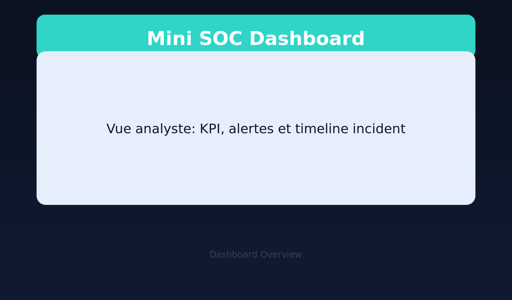
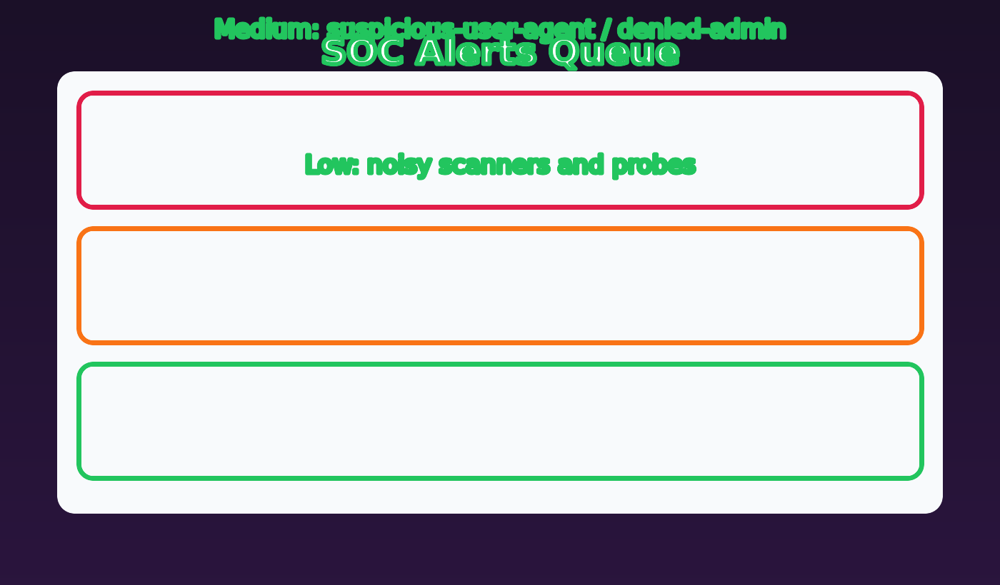
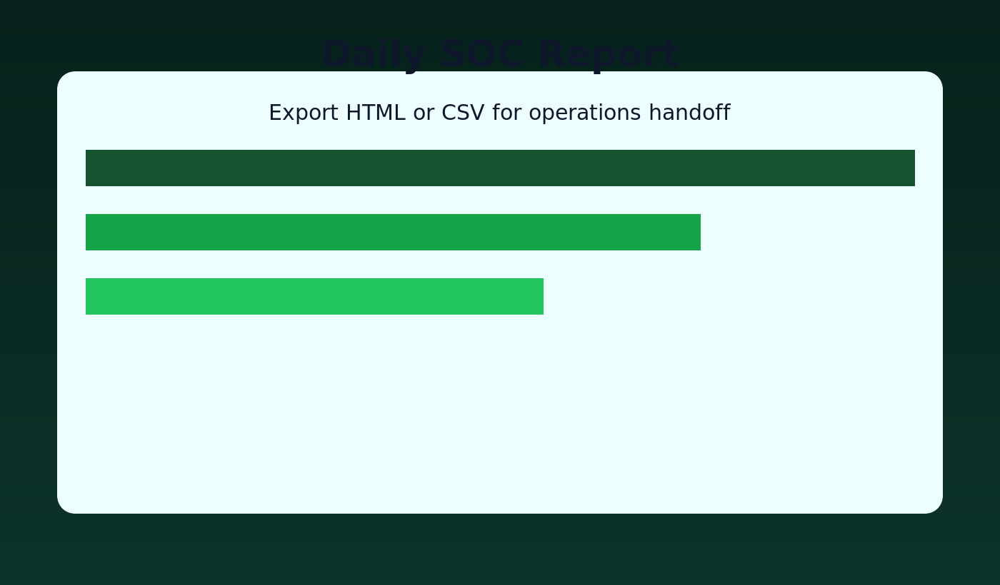

# Mini SOC Dashboard

FR/EN documentation for a lightweight SOC dashboard built with FastAPI and SQLite.

Current release: **v1.3.0** (2026-05-08). See [CHANGELOG.md](CHANGELOG.md).

---

## 🇫🇷 Français

### Vue d’ensemble
Mini SOC Dashboard est une application web orientée Blue Team pour :
- ingérer des logs applicatifs,
- détecter des comportements suspects,
- suivre les alertes et incidents,
- produire des rapports opérationnels.

Le projet est adapté à la démonstration SOC, aux labs de détection, et comme base de travail pour des évolutions plus avancées.


### Fonctionnalités

#### Ingestion & parsing
- Ingestion de logs via fichier (`POST /api/logs/ingest`) et JSON (`POST /api/logs/ingest-json`).
- Parsing JSON lines + format Apache/Nginx-like.
- Live tail de fichier local (`/api/live-tail/*`).


#### Détection
- Règles unitaires :
  - `failed-login-attempt`
  - `suspicious-user-agent`
  - `injection-or-traversal`
  - `admin-access-denied`
- Règles corrélées / batch :
  - `possible-bruteforce`
  - `possible-account-compromise`
  - `error-spike-5xx`
- Corrélation multi-signaux par IP : `correlated-attack-chain`.
- IOC watchlist (IP/path/user-agent/text) avec override de sévérité.

#### Opérations SOC
- Gestion d’alertes (statut, assignation, note, occurrences).
- Contexte d’alerte (logs liés, événements incidents, playbook).
- Timeline incident.
- Case management (cases, actions, commentaires, lien case↔alert).
- Suppressions temporaires (TTL).
- Asset mapping (IP/CIDR ou path prefix) + criticité.
- Policies automatiques (création de case, escalation, notification).

#### Reporting & export
- KPI SOC (`/api/stats`), radar risque, delta report.
- Vue analytique SOC agrégée (`/api/analytics/overview?window_hours=24`).
- Rapport quotidien HTML (`/api/reports/daily`, `/reports/daily`).
- Scheduler de rapports.
- Export CSV logs/alertes.

#### Administration
- Healthcheck, backup/restore SQLite, reset admin, wallboard.

### Aperçu visuel




### Architecture
- **Backend**: FastAPI
- **Storage**: SQLite (`data/soc.db`)
- **Frontend**: HTML/CSS/JS natif
- **Config règles**: `config/rules.yaml`
- **Migrations**: Alembic
- **Qualité**: pytest, ruff, mypy, CI GitHub Actions

### Structure du projet
```text
app/
  main.py            # Routes API + orchestration
  parser.py          # Normalisation logs
  detector.py        # Registre de règles
  database.py        # Accès SQLite + schéma
  rules.py           # Chargement rules.yaml
  schemas.py         # Validation payloads (Pydantic)
  notifier.py        # Webhook alertes
  tailer.py          # Live tail
  playbook.py        # Playbooks SOC
  templates/         # UI HTML
  static/            # UI CSS/JS

config/
  rules.yaml

data/
  sample.log

alembic/
  versions/

tests/
  test_*.py
```

### Prérequis
- Python 3.11+
- pip
- (optionnel) Docker + Docker Compose

### Installation locale
```bash
python3 -m venv .venv
. .venv/bin/activate
pip install -r requirements.txt
alembic upgrade head
uvicorn app.main:app --reload --host 0.0.0.0 --port 8000
```

Accès : `http://localhost:8000`

Identifiants par défaut :
- user: `admin`
- password: `admin123`

### Lancement Docker
```bash
docker compose up --build
```

### Configuration (variables d’environnement)

#### Auth
- `SOC_DASHBOARD_USERNAME` (default `admin`)
- `SOC_DASHBOARD_PASSWORD` (default `admin123`)
- `SOC_DASHBOARD_SECRET`


#### Ingestion
- `SOC_INGEST_API_KEY` (header `X-API-Key`)
- `SOC_INGEST_RATE_LIMIT_PER_MIN` (default `120`)
- `SOC_INGEST_MAX_BYTES` (default `5242880`)

#### Notifications
- `SOC_WEBHOOK_URL`
- `SOC_WEBHOOK_MIN_SEVERITY` (`low|medium|high`, default `high`)

#### Auto-escalation
- `SOC_ESCALATE_MINUTES` (default `20`)
- `SOC_ESCALATE_ASSIGNEE` (default `soc-escalation`)

#### Rétention
- `SOC_RETENTION_LOGS_DAYS` (default `30`)
- `SOC_RETENTION_ALERTS_DAYS` (default `90`)
- `SOC_RETENTION_EVENTS_DAYS` (default `90`)
- `SOC_RETENTION_REPORTS_DAYS` (default `30`)
- `SOC_RETENTION_BACKUPS_DAYS` (default `30`)

### Base de données et migrations
```bash
alembic upgrade head
# ou
make migrate
```

Migration baseline incluse : `20260423_0001`.

### API principale

#### Santé / settings / metrics
- `GET /api/health`
- `GET /api/settings`
- `GET /api/metrics`
- `GET /api/analytics/overview?window_hours=24`

#### Logs & alertes
- `POST /api/logs/ingest`
- `POST /api/logs/ingest-json`
- `GET /api/logs?...&limit=200&offset=0`
- `GET /api/alerts?...&limit=200&offset=0`
- DSL: `dsl=ip:1.2.3.4 method:POST code:401`
- `PATCH /api/alerts/{id}`
- `GET /api/alerts/{id}/context`
- `GET /api/playbook/{alert_type}`

#### Cases & incidents
- `GET/POST/PATCH /api/cases`
- `POST/DELETE /api/cases/{case_id}/alerts/{alert_id}`
- `GET /api/cases/{case_id}`
- `GET/POST/DELETE /api/cases/{case_id}/comments`
- `GET /api/incidents/timeline`

#### IOC / policies / assets / suppressions
- `GET/POST/PATCH/DELETE /api/iocs`
- `GET/POST/PATCH/DELETE /api/policies`
- `GET/POST/DELETE /api/assets`
- `GET/POST/DELETE /api/suppressions`

#### Reports / export / admin
- `GET /api/stats`
- `GET /api/risk/entities`
- `GET /api/reports/daily`
- `GET /reports/daily`
- `GET/POST/PATCH/DELETE /api/reports/schedules`
- `POST /api/reports/schedules/{id}/run`
- `GET /api/reports/runs`
- `GET /api/reports/delta`
- `GET /api/export/logs.csv`
- `GET /api/export/alerts.csv`
- `GET /api/admin/backups`
- `POST /api/admin/backup`
- `POST /api/admin/restore`
- `POST /api/admin/reset`

#### Live updates
- `WS /ws/live`
- `POST /api/live-tail/start`
- `POST /api/live-tail/stop`
- `GET /api/live-tail/status`

### Détection et extensibilité
`app/detector.py` utilise un registre de règles :
- `register_single_rule`
- `register_batch_rule`

Pour ajouter une règle :
1. créer la fonction de détection,
2. l’enregistrer,
3. ajouter les tests associés.

### Sécurité & bonnes pratiques
- Ne pas committer de secrets ni de logs de production.
- Changer les credentials par défaut.
- Activer `SOC_INGEST_API_KEY` en environnement exposé.
- Déployer derrière HTTPS + reverse proxy + contrôle d’accès.

### Observabilité
- Endpoint métriques: `GET /api/metrics` (format texte Prometheus).
- Exemples :
  - `ingest_requests_total`
  - `ingest_lines_total`
  - `ingest_alerts_total`
  - `ingest_rate_limited_total`
  - `ws_connections_total`
  - `backup_success_total`

### Qualité, tests, CI
Local :
```bash
make test
make lint
make typecheck
```

CI GitHub Actions (`.github/workflows/ci.yml`) :
1. install deps,
2. `ruff check .`,
3. `mypy app`,
4. `pytest -q`.

### Troubleshooting
- `ModuleNotFoundError`: installer `requirements.txt` dans le venv.
- Port occupé: changer `--port`.
- Schéma DB: relancer `alembic upgrade head`.
- Pas d’alertes: vérifier format logs + `config/rules.yaml` + filtres.

### Roadmap
- migration FastAPI `on_event` -> `lifespan`,
- RBAC analyst/admin,
- authentification OIDC,
- enrichissement threat intel,
- pipeline d’ingestion asynchrone.

---

## 🇬🇧 English

### Overview
Mini SOC Dashboard is a lightweight **FastAPI + SQLite** web app to:
- ingest logs,
- detect suspicious activity,
- triage alerts/incidents,
- generate SOC-oriented reports.

It is designed for local SOC demos, detection labs, and as a practical baseline for more advanced security operations workflows.

### Features
- Log ingestion (file and JSON API).
- JSON line and Apache/Nginx-like parsing.
- Detection rules (single-event and batch/correlated).
- IOC watchlist with severity override.
- Alert lifecycle management.
- Incident timeline + case management.
- Asset mapping and suppression rules.
- Policy engine (auto-create case/escalate/notify).
- Reporting (daily, scheduled, delta) and CSV export.
- Aggregated SOC analytics endpoint (`/api/analytics/overview`).
- Live websocket updates and file live tail.
- Backup/restore and admin reset operations.

### Visual preview


### Tech stack
- Backend: FastAPI
- DB: SQLite
- Frontend: vanilla HTML/CSS/JS
- Rules: YAML
- Migrations: Alembic
- QA: pytest, ruff, mypy, GitHub Actions

### Project layout
```text
app/        # API, detection, parsing, schemas, UI assets
actions/    # (none, CI is under .github/workflows)
config/     # rule configuration
data/       # sample data
alembic/    # DB migrations
tests/      # test suite
```

### Local setup
```bash
python3 -m venv .venv
. .venv/bin/activate
pip install -r requirements.txt
alembic upgrade head
uvicorn app.main:app --reload --host 0.0.0.0 --port 8000
```

Open: `http://localhost:8000`

Default credentials:
- user: `admin`
- password: `admin123`

### Docker
```bash
docker compose up --build
```

### Environment variables
- Auth: `SOC_DASHBOARD_USERNAME`, `SOC_DASHBOARD_PASSWORD`, `SOC_DASHBOARD_SECRET`
- Ingestion: `SOC_INGEST_API_KEY`, `SOC_INGEST_RATE_LIMIT_PER_MIN`, `SOC_INGEST_MAX_BYTES`
- Notifications: `SOC_WEBHOOK_URL`, `SOC_WEBHOOK_MIN_SEVERITY`
- Auto-escalation: `SOC_ESCALATE_MINUTES`, `SOC_ESCALATE_ASSIGNEE`
- Retention: `SOC_RETENTION_LOGS_DAYS`, `SOC_RETENTION_ALERTS_DAYS`, `SOC_RETENTION_EVENTS_DAYS`, `SOC_RETENTION_REPORTS_DAYS`, `SOC_RETENTION_BACKUPS_DAYS`

### Migrations
```bash
alembic upgrade head
# or
make migrate
```

### Main API groups
- Health/settings/metrics
- Log ingestion/query
- Alert query/update/context
- Cases/comments/incident timeline
- IOC/policies/assets/suppressions
- Reports/export/admin
- Live websocket and live tail

### Security notes
- Never commit secrets or real production logs.
- Change default credentials immediately.
- Enable API key ingestion on exposed environments.
- Run behind HTTPS and access controls.

### Quality and CI
Local commands:
```bash
make test
make lint
make typecheck
```

CI pipeline runs `ruff`, `mypy`, and `pytest` on push/PR.

### Troubleshooting
- Missing dependencies: reinstall `requirements.txt` in your venv.
- DB schema mismatch: run `alembic upgrade head`.
- No alerts generated: validate input log format, rules config, and query filters.

---

Contributions are welcome.
